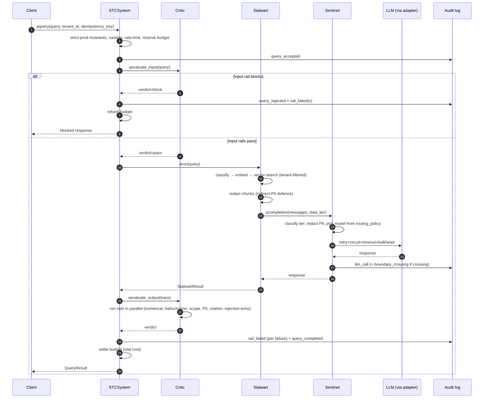
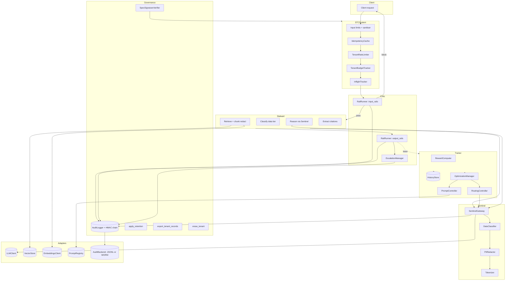

# Architecture

## One-sentence summary

STC separates AI-agent concerns into three personas (Stalwart, Trainer,
Critic) plus an infrastructure layer (Sentinel), all driven by a single
versioned declarative spec, so that execution, optimization, and
governance can evolve independently without breaking compliance.

## One-paragraph overview

A request arrives at `STCSystem.aquery`. It passes through the Critic's
input rails (injection, prompt-abuse), then the Stalwart retrieves
document chunks and reasons over them via the Sentinel gateway (which
redacts PII, enforces data-tier routing, and audits the boundary
crossing). The raw response is evaluated by the Critic's output rails
(hallucination grounding, numerical accuracy, citation required,
scope, PII in response). Everything emits a hash-chained audit record
through `AuditLogger`, a Prometheus metric, and an OpenTelemetry span.
The Trainer observes traces asynchronously and adjusts prompt /
routing preferences via controllers that act through the Sentinel —
never directly.

## The four architectural planes

| Plane | Module | Responsibility |
|---|---|---|
| **Execution** | `stc_framework.stalwart` | Run the business task (classify → retrieve → reason) |
| **Optimization** | `stc_framework.trainer` | Learn from traces and adjust prompts / routing |
| **Governance** | `stc_framework.critic` | Verify every response; enforce rails; escalate |
| **Infrastructure** | `stc_framework.sentinel` | Classify data tier, redact PII, route through LLM gateway, audit boundary crossings |

These planes cannot call each other arbitrarily. The allowed paths are:

- Stalwart → Sentinel (for LLM calls, always)
- Critic → any Stalwart output (read-only)
- Trainer → Sentinel (for routing control), PromptRegistry (for prompt
  control), never directly to Stalwart or Critic
- Sentinel → adapter protocols only (LLM, vector, embedding, audit)

## End-to-end data flow

## Component topology

## The four trust boundaries

Every arrow that crosses one of these is instrumented. If a change
introduces a new path that crosses a boundary without audit, it's a
compliance regression.

1. **Client ↔ STCSystem** — sanitisation, size limits, rate limit,
   budget. The `aquery` entry point is the *only* public ingress into
   the library.
2. **Tenant ↔ Tenant** — enforced by the `tenant_id` filter on every
   vector search, audit query, budget lookup, and idempotency key.
3. **In-boundary ↔ external LLM** — `SentinelGateway` emits a
   `boundary_crossing` audit whenever the selected model is not
   local/VPC.
4. **Mutable state ↔ immutable audit** — audit records are the only
   mutable store we write with HMAC-chained integrity. Everything else
   (history, vector, tokens) can be regenerated; audit cannot.

## Where responsibilities live

| Concern | Who owns it | Where it lives |
|---|---|---|
| Turning a user query into an LLM call | Stalwart | `stalwart/agent.py` |
| Deciding which model is reached | Sentinel | `sentinel/gateway.py::get_routing` |
| Stopping a harmful response | Critic | `critic/critic.py::aevaluate_output` |
| Deciding when to rotate a prompt | Trainer | `trainer/prompt_controller.py` |
| Recording "this happened" | AuditLogger | `observability/audit.py` |
| Rejecting abusive inputs | STCSystem + Critic input rails | `system.py::aquery`, `critic/validators/injection.py` |
| Enforcing "restricted data stays local" | Sentinel + spec validator | `sentinel/gateway.py`, `spec/models.py::_validate_routing_tiers` |
| GDPR Art. 17 erasure | Governance | `governance/erasure.py` |
| FINRA 17a-4 non-erasable audit | WORMAuditBackend | `adapters/audit_backend/worm.py` |

## What does NOT live where you'd expect

- **Metrics** are created in `observability/metrics.py` but bumped by
  whoever observes the event — audit writes bump
  `governance_events_total`, not the audit module.
- **Correlation fields** (trace_id, tenant_id) are in a `contextvars`
  `ContextVar`, not passed as function args. Everything downstream
  reads them from there.
- **Rate limiting** is not on the Flask middleware — it's in
  `STCSystem.aquery` itself, so library callers get the same protection
  as HTTP callers.
- **Idempotency** is NOT at the HTTP layer — it's in `aquery` keyed by
  `(tenant_id, idempotency_key)` so that retries across restart, across
  Flask workers, behave the same.

## How to extend (pointer only)

Read `CONTRIBUTING.md` for step-by-step recipes. Summary:

- **New rail** → `critic/validators/*.py` + entry in
  `critic.py::validators` dict + spec rail entry + test.
- **New LLM provider** → `adapters/llm/*.py` implementing the `LLMClient`
  Protocol + `STC_LLM_ADAPTER=<name>` + map errors to the taxonomy.
- **New event type** → entry in `governance/events.py::AuditEvent` +
  optional default retention in `spec/models.py::RetentionPolicy`.
- **New audit backend** → `adapters/audit_backend/*.py` implementing
  `AuditBackend`; register in `STCSystem._build_default_audit_backend`.

## Non-obvious invariants (read these before you edit)

1. **Restricted data never leaves the boundary.** Enforced at *three*
   points: spec load (`_validate_routing_tiers`), routing mutation
   (`set_routing_preference`), and dispatch (`acompletion`). Removing
   any one is a compliance regression.
2. **Audit chain keys survive rotation.** Every record carries `key_id`;
   old records remain verifiable with their original key.
3. **Budget reservation is atomic with enforcement.** The `reserve`
   path holds the lock across the check AND the book — a plain
   `enforce + record_cost` has a TOCTOU race.
4. **Retention ignores "forever" classes.** `apply_retention` refuses
   to prune files when any configured retention class is negative —
   avoids deleting chain-seal records.
5. **The spec is a load-bearing artifact.** It's the compliance
   posture. `STC_ENV=prod` refuses to boot without a valid ed25519
   signature verifying against `STC_SPEC_PUBLIC_KEY`.
